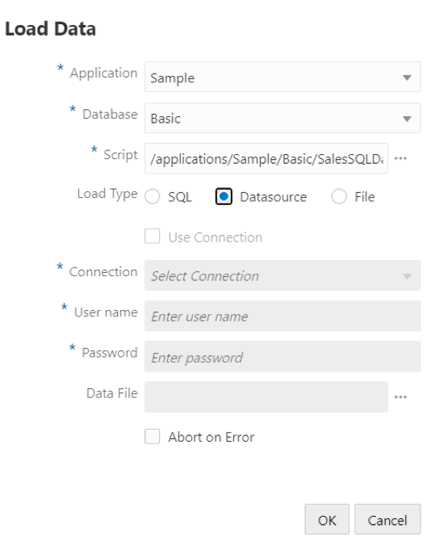
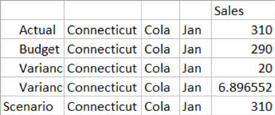

# Lab 15: Essbase and ADW

## Introduction 

In this lab we will learn how to Build a Essbase cube sourcing data from Autonomous Data Warehouse (ADW Database).  We will build dimension and load data using ADW data. We will use Essbase drill-through functionality to display additional detailed data that is retrieved from Autonomous Data Warehouse. Through Essbase Smart View for Office, we will interactively investigate the data in Essbase, slice and dice the data and do ad hoc analysis on it. 

## Objectives

* Procuring ADW instance
* Loading data to ADW instance
* Create a connection from Essbase 19c to ADW
* Build dimension using ADW data
* Load data from ADW to Essbase cube
* View / Analyze ADW data in smart view
* Drill Thru to ADW data from smartview

## Required Artifacts 

* The following lab requires an Oracle Public Cloud account with an Essbase 19c Instance and corresponding access to create new Autonomous Database.
* Smartview plugin for MS-Excel.
* The estimated time to complete this lab is 20 minutes.

##  Part 1 - Provisioning an ADW Instance

### Step 1: Sign in to Oracle Cloud

1. Go to (cloud.oracle.com)[cloud.oracle.com], click on the **Person Icon**

2. Then click on **Sign in to Cloud** to sign in with your Oracle Cloud account.

3. Enter your **Cloud Account Name** and click **Next**.

4. Enter your Oracle Cloud **username** and **password**, and click **Sign In**.

### Step 2: Create an ADW Instance

1. If after logging in, you are taken to the screen below, click on **Infrastructure Dashboard**. If you do not see the screen below when you login, skip this step and move on to the next step below.

2. Once you are logged in, you are taken to the OCI Console. Click **Create a data warehouse**.

3. This will bring up the Create Autonomous Data Warehouse screen where you will specify the configurations of the instance. Compartments are used to organize resources in the Cloud. Using the drop down, select **EssbaseSalesPlay** from the compartment list.

4. Specify a memorable display name for the instance and database's name, here **EssbaseADW**.

5. Then, scroll down and select the CPU core count and Storage (TB) size. Here, we use 1 CPU and 1 TB of storage.

6. Uncheck Auto scaling for the purposes of this workshop.

7. Then, specify an ADMIN password for the instance, and a confirmation of it. Make a note of this password.

8. For this lab, we will select **License Included** for the license type. If your organization owns Oracle Database licenses already, you may bring those licenses to your cloud service.

9. Make sure everything is filled out correctly, then proceed to click on **Create Autonomous Data Warehouse**.

10. Your instance will begin provisioning. Once the state goes from Provisioning to Available, click on your ADW display name to see its details. Note: Here, the name is **EssbaseADW**.

11. You now have created your first Autonomous Data Warehouse instance. Have a look at your instance's details here including its name, database version, CPU count and storage size.

### Step 3: Download the Connection Wallet

As ADW only accepts secure connections to the database, you need to download a wallet file containing your credentials first. The wallet can be downloaded either from the instance's details page, or from the ADW service console. In this case, we will be showing you how to download the wallet file from the instance's details page. This wallet file can be used with a local version of software such as SQL Developer as well as others. It will also be used later in the lab so make note of where it is stored.

1. Go back to the Oracle Cloud Console and open the Instances screen. Find your database, click the action menu and select **DB Connection**.

2. Under Download a Connection Wallet, click **Download**.

3. Specify a password of your choice for the wallet. You will need this password when connecting to the database via SQL Developer later, and is also used as the JKS keystore password for JDBC applications that use JKS for security. Click **Download** to download the wallet file to your client machine. Download the wallet to a location you can easily access, because we will be using it in the next step.

**Note: If you are prevented from downloading your Connection Wallet, it may be due to your browser's pop-blocker. Please disable it or create an exception for Oracle Cloud domains.**

## Part 2 - Uploading data file to ADW 

**This section demonstrates how to import a table to ADW instance.**

1. Navigate to Autonomous Database section and select ADW instance created in previous step.

2. In Autonomous Database select Service Console.

3. In Development section in Service console.

4. Provide ADW instance username and password.

5. Import data file ``Sample_Basic_Table.txt`` containing data column to ADW instance.

6. Select horizontal ellipsis icon select Data loading -> Upload Data into New table.

7. Verify data loaded in to table.

## Part 3 - Create a Connection and Datasource for Oracle Autonomous Data Warehouse

For reference - [Click Here](https://docs.oracle.com/en/cloud/paas/analytics-cloud/essug/create-connection-and-datasource-access-oracle-autonomous-data-warehouse.html)

### Step 1 - Define a connection and Datasource between Essbase and Autonomous Data Warehouse.

1. In Essbase UI from home page, click **Sources**.

 

2. Click **Create Connection** and select **Oracle Database**.

3. Select **Autonomous** using the toggle switch.

4. Enter a connection name: ``essbaseADW`` and a service name: ``essbaseADW_medium`` 

5. Drag and drop a wallet file or click to upload. Upload the wallet file downloaded in Step 1 procuring ADW.

6. Enter your Autonomous Data Warehouse username, password, and optionally, a description.

7. Click **Test** to validate the connection, and if successful, click Create.

 

8. Verify that the connection was created successfully and appears in the list of connections. Next, you will create a Datasource for the Autonomous Data Warehouse connection.

9. Click **Datasources** and click **Create Datasource**. In this step we will create two datasources which are required in next sections.

10. From the Connection drop-down box, select the name of the connection you just created - ``EssbaseADW`` 

11. Provide a name for the Datasource; for example, ``ADW_Datasource``

12. Optionally enter a description of the Datasource; for example, **Autonomous Data Warehouse Datasource**.

13. In the **Query** field, provide the SQL query as :

``Select distinct market, statename from SAMPLE_BASIC_TABLE``

14. Click **Next**. If the SQL statement was correct to query an Autonomous Data Warehouse area, you should see the queried columns populated.
 

15. Leave parameters section as-is and click **Next**.

16. Review the preview panel. You should see the results of the SQL query fetching columns of data from Autonomous Data Warehouse.

 

17. If the preview looks correct, click **Create** to finish creating the Datasource.

18. Following similar steps create another datasource with name ``ADW_Dataload``

19. In the query section of ADW_Dataload datasource use:

``Select Product, Scenario, Statename, months, Sales from SAMPLE_BASIC_TABLE``

20. Preview tab for ADW_Dataload datasource should look similar to mentioned below.

## Part 4 - Build Dimensions Using SQL Datasource with ADW

1. We will delete some members from Sample Basic, and then create a load rule to rebuild the Market dimension from the ADW table. 

2. In the Essbase web interface, on the Applications page, expand the Sample application, and select the cube, Basic.

3. From the Actions menu to the right of Basic, select Outline.

4. Click the Market dimension, and then click member East.

5. Click Edit to lock the outline for editing.

6. Delete some of the states from the East market. For example, delete Connecticut, New Hampshire, and Massachusetts.

7. Click Save, and then verify that East now contains only the states Florida and New York. Next, you will create dimension build rules and repopulate the Market dimension, from the SQL table, with the states you have removed.

8. Close the Outline browser tab.

9. On the Applications page, from the Actions menu to the right of Basic, launch the inspector, click Scripts, then choose the Rules tab.

10. Click Create > Dimension Build (Regular) to begin defining new dimension build rules.

11. In the Name field, enter the name of the rules file as ``MarketSQLDimbuild``. Leave the other options as-is, and click Proceed.

12. Click the Dimensions button.

13. Click the field containing the text Select existing dimension, select Market, and click Add, then OK.

14. On the New Rule - ``MarketSQLDimbuild page``, click the Dimension drop-down field and select Market.

15. Click the Type drop-down field and select Generation. Increment the generation number to 2.

16. Click the Generation Name field and type REGION.The Market dimension is generation 1, and you added a child named Region.
 
 

17. Click Create > Regular to create a second dimension build rule field.
 

18. Name the field STATE and associate it with dimension Market, at generation 3.
 

19. Click the Source button to begin associating a data source with the dimension build rules.

20. Keep the fields in General tab as-is.

21. Back in the Edit Source dialog for your dimension build rule, in the SQL/Datasource Properties group select Datasource radio button. Select Datasource as ADW_Datasource from dropdown.
 

22. Click OK,, then Verify, Save and Close. to save and close the ``MarketSQLDimbuild`` rule.

23. Refresh the list of rules in the Scripts list to ensure that ``MarketSQLDimbuild`` has been added to the list of rule files for the cube Sample Basic.

24. Click Close. Next, you will use this rule file to load the members back into the Market dimension.

25. Click Jobs, and click New Job > Build Dimension.

26. Enter Sample as the application name, and Basic as the database name.

27. For the script name, select the name of the dimension build rule file you created, ``MarketSQLDimbuild``

28. Select Datasource as the load type.
 
 
 
29. From the Restructure Options drop-down list, select Preserve All Data.

30. Click OK to begin the job. The dimension build begins. Click the Refresh symbol to watch the status, and when it completes, click Job Details from the Actions menu.

31. Inspect the outline to verify that your dimensions were built (verify that Connecticut, New Hampshire, and Massachusetts exist as children under East).

## Part 5 - Load ADW Data to Essbase Using SQL Datasource

This task flow demonstrates how to clear data from a cube, create data load rules, load data (using SQL) from an ADW instance, and verify in Smart View that the data was loaded. 

After building the dimensions, you will clear data from the cube, and then load the data again from a table. In Essbase, click **Jobs**, and click **New Job**.

1. Select **Clear Data** as the job type. Select application Sample and database Basic and click OK.

2. Click OK to confirm that you want to clear data. The job begins. Click the Refresh symbol to watch the status, and when it completes, click **Job Details** from the Actions menu.

3. Connect to the Sample Basic cube from Smart View and do an ad hoc analysis.

4. Notice that data was cleared. For example:
 
 

Keep the worksheet open. Next, you will create load rules that use SQL to repopulate the Sales data from the table.

5. On the Applications page, expand the Sample application, and select the cube, Basic.

6. From the **Actions** menu to the right of Basic, launch the inspector, click **Scripts**, then choose the **Rules** tab.

7. Click **Create > Data** Load to begin defining new load rules.

8. In the **Name** field, enter the name of the rule file as ``SalesSQLDataload``.

9. In the **Data Dimension** drop-down box, select the Measures dimension.

10. Leave the other options as-is and click **Proceed**.

11. In ADW instance write and test a SELECT statement selecting some columns from the table ``SAMPLE_BASIC_TABLE`` : 

``Select Product, Scenario, Statename, months, Sales from SAMPLE_BASIC_TABLE;``

12. Ensure that the SQL query is valid and returns a result in your SQL tool. If the SQL query is valid, it should return the requested table columns, PRODUCT, SCENARIO, STATENAME, MONTHS and SALES, from the database to which your SQL tool is connected.

13. In Essbase, in the **New Rule** browser tab for your ``SalesSQLDataload`` rule, select Sales from the Select drop-down box.

 

14. Click **Create > Regular** to continue adding fields ,you will notice build rule has automatically picked fields from datasource.

15. Verify all the fields are properly mapped to columns in table.

16. From the third column **Select** drop-down box, select Market (which maps to Statename in your SQL query).

17. From the fourth column **Select** drop-down box, select Year (which maps to Months in your SQL query).

**Your load rule fields should now be arranged like this:**
	 

18. Click the **Source** button to begin associating a data source with the load rules.

19. In the **General** tab, leave fields empty. Navigate to SQL/Datasource Properties section and select Datasource radio button.

 

20. Verify, save, and close the SalesSQLDataload rule.

21. Refresh the list of rules in the Scripts list to ensure that ``SalesSQLDataload`` has been added to the list of rule files for the cube Sample Basic, and then close the database inspector.

**Next, you will load the data from Jobs.**

22. Click **Jobs**, and click **New Job > Load Data**.

23. Enter Sample as the application name, and Basic as the database name.

24. For the script name, select the name of the dimension build rule file you created, ``SalesSQLDataload``.

25. Select **Datasource** as the load type.
 
 
 
26. Click OK to begin the job.

The data load begins. Click the Refresh symbol to watch the status, and when it completes, click **Job Details** from the Actions menu.

27. Go back to the worksheet in Smart View, and refresh it to verify that the data was loaded from the table.
 

